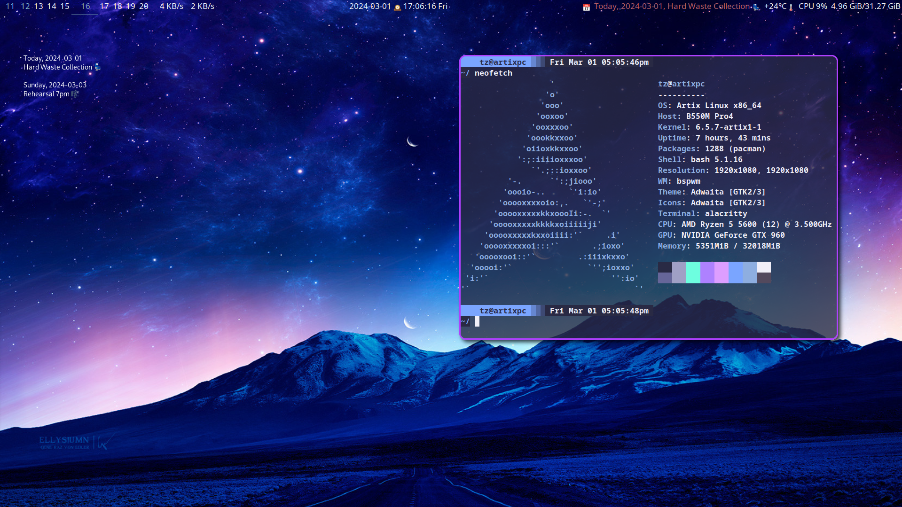

<h1 align="center">Lapis</h1>

- Distro: [Artix](https://artixlinux.org/)
- WM: [BSPWM](https://github.com/baskerville/bspwm)
- Bar: [Polybar](https://github.com/polybar/polybar)
- Launcher/Powermenu: [Rofi](https://github.com/davatorium/rofi)
- Terminal [Alacritty](https://github.com/alacritty/alacritty)
- Shell: [Zsh](https://www.zsh.org/)
- Editor: [Neovim](https://neovim.io/)
- Notification Daemon: [dunst](https://github.com/dunst-project/dunst)
- Widgets: [Eww](https://github.com/elkowar/eww)
